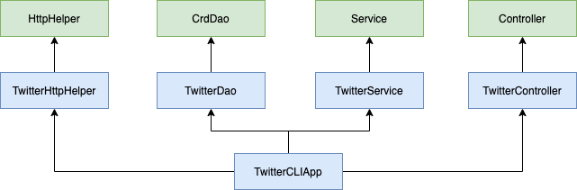

# Introduction
This app is used to implement a Java app which can post/show/delete Twitter 
post via Twitter REST API. Many concepts are implemented such as HTTP Client, Junit Test, Mockito, DAO, and Spring. 

# Quick Start
> - To package the app, simply using `mvn package` command. 
> - To run the app from docker, simply using following codes. 
> - `docker run --rm \
-e consumerKey=YOUR_VALUE \
-e consumerSecret=YOUR_VALUE \
-e accessToken=YOUR_VALUE \
-e tokenSecret=YOUR_VALUE \
david/twitter post|show|delete "test post content" "coordinates"(optional)`

# Design

> `TwitterHttphelper`: It is only responsible for executing HTTP with a given URI. In addition, it authorizes the HTTP request using Twitter secrets.
  `TwitterDao`: It constructs Twitter REST API URIs and make HTTP calls using `HttpHelper`. It also handles models and post/show/delete tweets. 
  `TwitterService`: It handles business logic such as maximum 140 words per tweet, range between -90 to 90 for longtitude. Additionally, it calls DAO layer using `TwitterDao`. 
  `TwitterControl`:It consumes user input (post|show|delete) and calls the corresponding service layer method. It does not handle any business logic.
  `TwitterCLIApp`: It declares and instantiates all components and calls run method which calls controller methods and print tweet(s).

# Models
In this App, we do not implement the full version of Tweet object. Instead, we implement a simplified
version of Tweet object:
* CREATED_AT (Str)
* ID (Long)
* ID_STR (Str)
* TEXT (Str)
* ENTITIES (Entities)
     * HashTag (Str)
     * UserMention (Str)
* COORDINATES (Coordinates)
     * Coordinates (ArrayList)
* RETWEET_COUNT (int)
* FAVOURITE_COUNT (int)
* FAVORITED (boolean)
* RETWEETED (boolean)

# Spring
In this App, we used two Spring approaches to solve the Dependencies management problem. 

A. `@Beans` Approach

1. Define dependency relationship using `@Bean` and pass dependencies through method arguments.
2. Create an IoC container/context which will automatically instantiate all Beans base on the relationship you specified in the previous step.
3. Get the main entry point (TwitterCLIBean) from the IoC container and start the program .

B. `@ComponentScan` Approach

1.  When working with Spring, we can annotate our classes in order to make them into Spring beans. 
But, besides that, we can tell Spring where to search for these annotated classes as not all of them 
must become beans in this particular run.
2. In this App, we Annonate the five classes in the Design part as `@Compoenent`, `@Repository`, `@Service`,
`@Controller` to tell IoC container that each class belongs to different beans. 
3. We will also use `@Autowired` annotation in each class to tell IoC container to inject dependency through the constructor.
4. Get the main entry point (TwitterCLIComponentScan) from the IoC container and start the program.

# Docker
To dockerize the app, I've created a Dockerfile and it can automatically dockerize the app. 

# Improvements
1. It's only a simplified version of Twitter so more functions and classes can definitely 
be implemented such as posting links, images and so on. 
2. ID in this app is valid as long as it's an integer. However, it's composed of three parts by 
official Twitter Doc, so a better ID validation process can be implemented. 
3. Delete test cases are set up manually, but it can be set up automatically by creating a test
tweet and then delete it. 